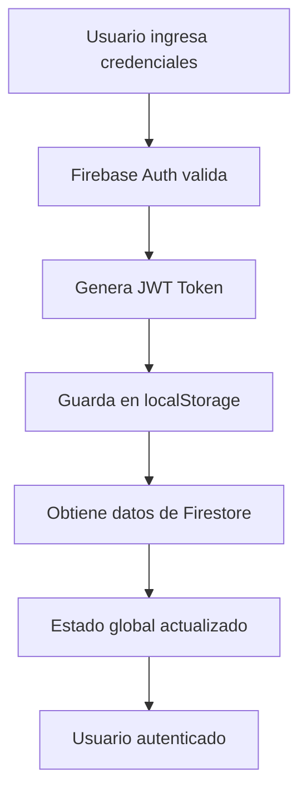

# Sistema de Autenticación

## 🔐 Cómo Funciona la Autenticación

### **Firebase Authentication**
El sistema utiliza **Firebase Authentication** que maneja automáticamente:

- ✅ **Tokens JWT** con expiración automática (1 hora por defecto)
- ✅ **Refresh tokens** para renovación automática
- ✅ **Persistencia de sesión** en localStorage del navegador
- ✅ **Logout automático** después de 24 horas
- ✅ **Seguridad robusta** con validación en servidor

### **Flujo de Autenticación**



## 🕒 Gestión de Tokens

### **Token JWT de Firebase**
- **Duración**: 1 hora por defecto
- **Renovación**: Automática con refresh token
- **Almacenamiento**: localStorage del navegador
- **Seguridad**: Firmado por Firebase, no modificable

### **Refresh Token**
- **Duración**: 30 días (configurable)
- **Función**: Renueva el JWT automáticamente
- **Transparente**: El usuario no nota la renovación

## 💾 Persistencia de Sesión

### **Almacenamiento**
```javascript
// Firebase maneja automáticamente:
localStorage.setItem('firebase:authUser:PROJECT_ID:[KEY]', {
  uid: 'user-id',
  email: 'user@example.com',
  // ... otros datos
})
```

### **Configuración de Persistencia**
Firebase Auth tiene 3 niveles de persistencia:

1. **LOCAL** (por defecto): Persiste hasta logout explícito
2. **SESSION**: Solo durante la sesión del navegador
3. **NONE**: No persiste, solo en memoria

### **Configuración Actual**
```javascript
import { setPersistence, browserLocalPersistence } from 'firebase/auth'

// Configurar persistencia local (por defecto)
setPersistence(auth, browserLocalPersistence)
```

## ⏰ Logout Automático

### **Sistema de 24 Horas**
El sistema implementa un **logout automático** después de 24 horas para:

- ✅ **Seguridad mejorada**: Evita sesiones prolongadas
- ✅ **Prevención de errores**: Evita problemas por tokens expirados
- ✅ **Mejores prácticas**: Cumple estándares de seguridad

### **Funcionamiento**
```javascript
// Timer automático configurado en:
function setupAutoLogout() {
  logoutTimer = setTimeout(async () => {
    await auth.signOut()
    localStorage.clear()
    window.location.href = '/'
  }, 24 * 60 * 60 * 1000) // 24 horas
}
```

### **Cuándo se Activa**
- ✅ **Al hacer login**: Timer se configura automáticamente
- ✅ **Al recargar página**: Si hay sesión activa, se reconfigura
- ✅ **Nuevo login**: Reemplaza timer anterior

### **Cuándo se Limpia**
- ✅ **Logout manual**: Timer se cancela
- ✅ **Cierre de sesión**: Timer se limpia automáticamente
- ✅ **Error de autenticación**: Timer se limpia

## 🔄 Estados de Autenticación

### **Estados Posibles**
1. **Loading**: Verificando autenticación
2. **Authenticated**: Usuario logueado
3. **Unauthenticated**: Usuario no logueado
4. **Error**: Error en autenticación
5. **Auto-logout**: Sesión expirada por tiempo

### **Manejo en la Aplicación**
```typescript
const { user, loading } = useAuth()

if (loading) return <Loading />
if (!user) return <LoginForm />
return <Dashboard />
```

## 🛡️ Seguridad

### **Validación en Cliente**
- Tokens verificados por Firebase SDK
- Renovación automática de tokens
- Logout automático si token inválido

### **Validación en Servidor**
- API routes verifican tokens
- Firebase Admin SDK valida tokens
- Acceso controlado por roles

### **Protección de Rutas**
```typescript
// Middleware de protección
export function requireAuth(handler) {
  return async (req, res) => {
    const token = req.headers.authorization
    const decodedToken = await admin.auth().verifyIdToken(token)
    
    if (!decodedToken) {
      return res.status(401).json({ error: 'No autorizado' })
    }
    
    return handler(req, res)
  }
}
```

## ⚙️ Configuración Avanzada

### **Personalizar Duración de Tokens**
```javascript
// En Firebase Console > Authentication > Settings
{
  "tokenExpiration": {
    "accessToken": "1h",     // JWT token
    "refreshToken": "30d"    // Refresh token
  }
}
```

### **Configurar Persistencia Personalizada**
```javascript
import { 
  setPersistence, 
  browserLocalPersistence,
  browserSessionPersistence 
} from 'firebase/auth'

// Para persistencia local (recomendado)
setPersistence(auth, browserLocalPersistence)

// Para persistencia solo de sesión
setPersistence(auth, browserSessionPersistence)
```

## 🔧 Comandos Útiles

### **Verificar Estado de Autenticación**
```javascript
import { getAuth, onAuthStateChanged } from 'firebase/auth'

const auth = getAuth()
onAuthStateChanged(auth, (user) => {
  if (user) {
    console.log('Usuario logueado:', user.uid)
  } else {
    console.log('Usuario no logueado')
  }
})
```

### **Obtener Token Actual**
```javascript
import { getAuth } from 'firebase/auth'

const auth = getAuth()
const user = auth.currentUser

if (user) {
  const token = await user.getIdToken()
  console.log('Token:', token)
}
```

### **Forzar Renovación de Token**
```javascript
const token = await user.getIdToken(true) // true = forzar renovación
```

## 📊 Monitoreo

### **Logs de Autenticación**
- Firebase Console > Authentication > Users
- Firebase Console > Authentication > Usage
- Logs en tiempo real de autenticaciones

### **Métricas Importantes**
- Tiempo de sesión promedio
- Frecuencia de renovación de tokens
- Errores de autenticación
- Logouts automáticos

## 🚨 Troubleshooting

### **Problemas Comunes**

1. **Token expirado**
   - Solución: Firebase renueva automáticamente
   - Verificar: Configuración de refresh token

2. **Sesión perdida al refrescar**
   - Solución: Verificar persistencia configurada
   - Verificar: localStorage habilitado

3. **Error de CORS**
   - Solución: Configurar dominios en Firebase Console
   - Verificar: Variables de entorno

### **Debug**
```javascript
// Habilitar logs detallados
import { connectAuthEmulator } from 'firebase/auth'

if (process.env.NODE_ENV === 'development') {
  connectAuthEmulator(auth, 'http://localhost:9099')
}
```

## 🔄 Migración de Tokens Personalizados

Si necesitas tokens personalizados con duración específica:

### **Opción 1: Custom Claims**
```javascript
// En Firebase Functions
await admin.auth().setCustomUserClaims(uid, {
  role: 'admin',
  tenantId: 'tenant-123'
})

// En cliente
const token = await user.getIdToken()
const claims = token.claims
```

### **Opción 2: Custom Token Service**
```javascript
// Crear servicio personalizado
export class CustomAuthService {
  async createCustomToken(uid: string, claims: any) {
    return admin.auth().createCustomToken(uid, claims)
  }
  
  async verifyCustomToken(token: string) {
    return admin.auth().verifyIdToken(token)
  }
}
```

## 📈 Mejores Prácticas

### **Seguridad**
- ✅ Nunca almacenar tokens en localStorage sensible
- ✅ Usar HTTPS siempre
- ✅ Validar tokens en servidor
- ✅ Implementar rate limiting

### **Performance**
- ✅ Cachear datos de usuario
- ✅ Lazy loading de componentes
- ✅ Minimizar llamadas a Firebase

### **UX**
- ✅ Estados de loading claros
- ✅ Manejo de errores amigable
- ✅ Persistencia transparente
- ✅ Logout automático en inactividad
