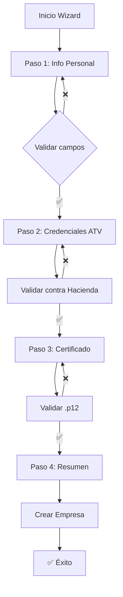

# Wizard de Creación de Empresas

## 📋 Descripción General

El wizard de creación de empresas es un proceso guiado de 4 pasos que permite a los usuarios registrar una nueva empresa en el sistema de facturación electrónica de Costa Rica. Incluye validaciones robustas para garantizar que todos los datos sean correctos antes de proceder con la facturación.

## 🚀 Características Principales

### ✅ Validaciones Automáticas
- **Credenciales ATV**: Validación en tiempo real contra el sistema de Hacienda
- **Certificado .p12**: Verificación de que corresponde a la razón social
- **Formato de datos**: Validación de cédulas, emails, teléfonos
- **Seguridad**: Encriptación de datos sensibles

### 🎨 Interfaz Intuitiva
- **Barra de progreso animada** con efectos visuales
- **Validación en tiempo real** con feedback inmediato
- **Diseño responsivo** para móviles y desktop
- **Iconografía clara** para cada sección

## 📝 Pasos del Wizard

### Paso 1: Información Personal
**Campos requeridos:**
- ✅ Razón Social
- ✅ Nombre Comercial  
- ✅ Tipo de Cédula (Física/Jurídica)
- ✅ Cédula (con formato automático)
- ✅ Correo electrónico
- ✅ Teléfono (con código país)
- ✅ Provincia, Cantón, Distrito
- 🔸 Barrio (opcional)
- 🔸 Logo de la empresa (opcional)

**Validaciones:**
- Formato de cédula jurídica (3-101-123456)
- Email válido
- Teléfono con código de país
- Campos obligatorios completos

### Paso 2: Credenciales ATV
**Campos requeridos:**
- ✅ Usuario ATV (email)
- ✅ Contraseña ATV
- ✅ Client ID
- ✅ URL de Recepción
- ✅ URL de Login

**Validaciones:**
- Conexión exitosa con Hacienda
- Credenciales válidas
- Token de acceso obtenido

**Endpoints de validación:**
```bash
curl --location 'https://idp.comprobanteselectronicos.go.cr/auth/realms/rut-stag/protocol/openid-connect/token' \
--header 'Content-Type: application/x-www-form-urlencoded' \
--data-urlencode 'grant_type=password' \
--data-urlencode 'client_id=api-stag' \
--data-urlencode 'username=cpf-03-0447-0021@stag.comprobanteselectronicos.go.cr' \
--data-urlencode 'password=xn5_/]#8E.GyG4K$/?2#'
```

### Paso 3: Certificado Digital
**Campos requeridos:**
- ✅ Archivo .p12 o .pfx
- ✅ Clave del certificado

**Validaciones:**
- Archivo válido (.p12/.pfx)
- Clave correcta para el certificado
- Certificado corresponde a la razón social
- Certificado no expirado

### Paso 4: Resumen y Confirmación
**Información mostrada:**
- 📋 Resumen completo de todos los datos
- 🔒 Indicadores de validación exitosa
- ⚠️ Advertencias de seguridad
- ✅ Botón de confirmación final

## 🔐 Seguridad

### Encriptación de Datos Sensibles
```typescript
// Contraseñas y certificados se encriptan antes de almacenar
const encryptedPassword = await EncryptionService.encrypt(
  password,
  masterKey
)
```

**Datos encriptados:**
- Contraseña ATV
- Clave del certificado .p12
- Información sensible del certificado

### Variables de Entorno Requeridas
```env
MASTER_ENCRYPTION_KEY=your-secure-master-key-here
```

## 🛠️ API Routes

### POST /api/company/validate-atv
Valida credenciales ATV contra Hacienda
```json
{
  "username": "user@example.com",
  "password": "password123",
  "clientId": "api-stag"
}
```

### POST /api/company/validate-certificate
Valida certificado .p12
```form-data
p12File: File
password: string
taxId: string
```

### POST /api/company/create
Crea la empresa en Firestore
```json
{
  "personalInfo": { ... },
  "atvCredentials": { ... },
  "certificate": { ... },
  "primaryColor": "#10b981"
}
```

## 🎯 Flujo de Validación



## 📱 Componentes Principales

### ProgressBar
Barra de progreso animada con efectos visuales
```tsx
<ProgressBar currentStep={currentStep} totalSteps={4} />
```

### CompanySummary
Resumen visual de todos los datos ingresados
```tsx
<CompanySummary data={formData} />
```

### Validación en Tiempo Real
```tsx
const validateATVCredentials = async () => {
  const result = await ATVValidator.validateCredentials(username, password)
  setValidationResults(prev => ({ ...prev, atv: result }))
}
```

## 🔧 Configuración

### Estructura de Datos Tenant
```typescript
interface Tenant {
  // Información básica
  name: string
  legalName: string
  taxId: string
  taxIdType: 'fisica' | 'juridica'
  
  // Ubicación
  province: string
  canton: string
  district: string
  barrio?: string
  
  // Contacto
  email: string
  phone: string
  
  // Credenciales ATV (encriptadas)
  atvCredentials: {
    username: string
    password: string // encriptada
    clientId: string
    receptionUrl: string
    loginUrl: string
  }
  
  // Certificado (encriptado)
  certificate: {
    fileName: string
    password: string // encriptada
    isValidated: boolean
    validationDate?: Date
  }
  
  // Sistema
  ownerId: string
  createdAt: Date
  updatedAt: Date
}
```

## 🚨 Manejo de Errores

### Errores Comunes
- **Credenciales ATV inválidas**: Verificar usuario y contraseña
- **Certificado no válido**: Verificar archivo y clave
- **Certificado no coincide**: Verificar que corresponda a la razón social
- **Certificado expirado**: Renovar certificado con el emisor

### Mensajes de Error Amigables
```typescript
const errorMessages = {
  'invalid_grant': 'Credenciales incorrectas. Verifique su usuario y contraseña.',
  'invalid_client': 'Client ID inválido. Verifique la configuración.',
  'certificate_expired': 'El certificado ha expirado. Renuévelo con el emisor.'
}
```

## 📊 Métricas y Monitoreo

### Eventos Rastreados
- Inicio de wizard
- Completado por paso
- Errores de validación
- Tiempo de completado
- Abandono de wizard

### Logs Importantes
```typescript
console.log('Wizard iniciado:', { userId, timestamp })
console.log('Validación ATV exitosa:', { username, timestamp })
console.log('Certificado validado:', { fileName, matchesTaxId })
console.log('Empresa creada:', { companyId, ownerId })
```

## 🔄 Actualizaciones Futuras

### Funcionalidades Planificadas
- [ ] Validación de certificados con librerías reales de criptografía
- [ ] Soporte para múltiples certificados por empresa
- [ ] Validación de cédula jurídica contra bases de datos oficiales
- [ ] Importación masiva de empresas
- [ ] Plantillas de configuración por tipo de empresa

### Mejoras de UX
- [ ] Guardado automático de progreso
- [ ] Recuperación de sesión
- [ ] Validación offline
- [ ] Modo oscuro optimizado
- [ ] Accesibilidad mejorada

## 🧪 Testing

### Casos de Prueba Críticos
1. **Wizard completo exitoso**
2. **Credenciales ATV inválidas**
3. **Certificado corrupto**
4. **Certificado de otra empresa**
5. **Validación de red fallida**
6. **Datos incompletos**

### Comandos de Testing
```bash
# Validar credenciales ATV
curl -X POST /api/company/validate-atv \
  -H "Content-Type: application/json" \
  -d '{"username":"test@example.com","password":"test123"}'

# Validar certificado
curl -X POST /api/company/validate-certificate \
  -F "p12File=@certificate.p12" \
  -F "password=testpass" \
  -F "taxId=3-101-123456"
```

## 📚 Referencias

- [Documentación ATV Costa Rica](https://www.hacienda.go.cr/)
- [Especificaciones PKCS#12](https://tools.ietf.org/html/rfc7292)
- [Web Crypto API](https://developer.mozilla.org/en-US/docs/Web/API/Web_Crypto_API)
- [Firebase Security Rules](https://firebase.google.com/docs/firestore/security/get-started)
